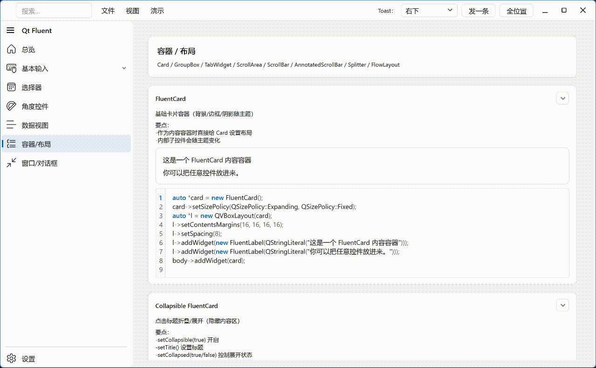
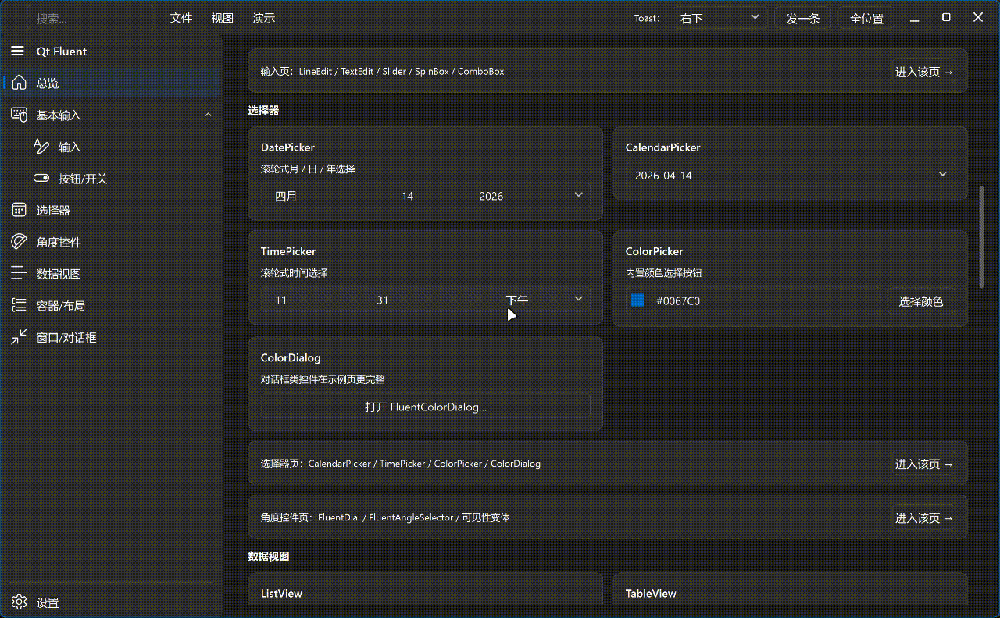

# QtFluentWidgets

一套基于 **Qt Widgets** 的 Fluent Design 风格控件库（含 Demo 与 Qt Designer 插件），提供统一的主题/色板管理与一组常用控件。

- 语言 / Languages：
	- 中文：README.md（默认） / [README.zh-CN.md](README.zh-CN.md)
	- English: [README.en-US.md](README.en-US.md)


## 预览

### 浅色模式：




### 深色模式：



## 特性

- Qt5 / Qt6 兼容（CMake 自动探测 Qt6，否则使用 Qt5）。
- 统一主题与色板：`ThemeManager` + `ThemeColors`。
- Fluent 风格输入控件面板：通过 `Style::paintControlSurface()` 统一圆角/边框/focus ring。
- Demo 覆盖所有控件，并带侧边栏联动配置（含 CodeEditor 的 clang-format 路径配置）。
- 可选 Qt Designer 插件（默认开启构建）。

## 快速开始

### 依赖

- CMake >= 3.16
- Qt Widgets（Qt5 或 Qt6）
- Qt Svg、Qt UiPlugin（用于 Demo / Designer 插件）

### 构建（推荐 out-of-source）

```bash
cmake -S . -B build
cmake --build build --config Release
```

如果你的 Qt 没有在默认搜索路径中，可传入 `CMAKE_PREFIX_PATH`（示例：Windows）：

```bash
cmake -S . -B build -DCMAKE_PREFIX_PATH="C:/Qt/6.6.0/msvc2019_64"
cmake --build build --config Release
```

### 运行 Demo

- CMake target：`QtFluentDemo`
- 也可以使用仓库提供的自定义 target：`run-QtFluentDemo`（会设置少量 demo 用的 env）

## 在你的项目中使用

### 方式 A：add_subdirectory（最简单）

```cmake
add_subdirectory(path/to/QtFluent)

target_link_libraries(your_app PRIVATE QtFluentWidgets)
```

然后在代码里包含头文件（均位于 `include/Fluent/`）：

```cpp
#include "Fluent/FluentButton.h"
#include "Fluent/FluentTheme.h"

using namespace Fluent;
```

### 方式 B：作为源码依赖

直接把 `include/`、`src/` 和 `CMakeLists.txt` 作为子模块/源码依赖引入即可。

## 文档（按模块拆分）

为了便于查阅，控件使用说明按模块拆分到 `docs/`，由本 README 跳转：

- 主题 / 样式： [docs/zh-cn/theme-style.md](docs/zh-cn/theme-style.md)
- 按钮与开关： [docs/zh-cn/buttons.md](docs/zh-cn/buttons.md)
- 输入与编辑： [docs/zh-cn/inputs.md](docs/zh-cn/inputs.md)
- 代码编辑器： [docs/zh-cn/code-editor.md](docs/zh-cn/code-editor.md)
- 选择器： [docs/zh-cn/pickers.md](docs/zh-cn/pickers.md)
- 数据视图： [docs/zh-cn/data-views.md](docs/zh-cn/data-views.md)
- 容器 / 布局： [docs/zh-cn/containers-layout.md](docs/zh-cn/containers-layout.md)
- 窗口 / 菜单 / 对话框： [docs/zh-cn/windows-dialogs.md](docs/zh-cn/windows-dialogs.md)
- 杂项与工具： [docs/zh-cn/utilities.md](docs/zh-cn/utilities.md)

## Qt Designer 插件

默认会构建 Designer 插件，输出到构建目录的 `designer/` 下。将生成的插件文件复制到 Qt Designer 的插件目录即可加载。

关闭插件构建：

```bash
cmake -S . -B build -DFLUENT_BUILD_DESIGNER_PLUGIN=OFF
cmake --build build
```

## Demo 导航（与模块一致）

Demo 的页面分组与文档模块基本一致：输入 / 按钮 / 选择器 / 数据视图 / 容器 / 窗口。
